# OAuth 认证示例

演示第三方应用如何通过OAuth 2.0的机制，访问 featapi.com 上的受限资源

流程：



## 本地运行

1. 拉取仓库代码

```bash
git clone https://github.com/feat/oauth_example
```

2. 创建 `.env` ，并填入 `FEAT_CLIENT_ID` 与 `FEAT_CLIENT_SECRET`

```bash
# 从模板中创建
cp .env.example .env
# 编辑
```

3. 安装依赖

```
npm install
```

4. 启动应用
   
```
npm start
```
